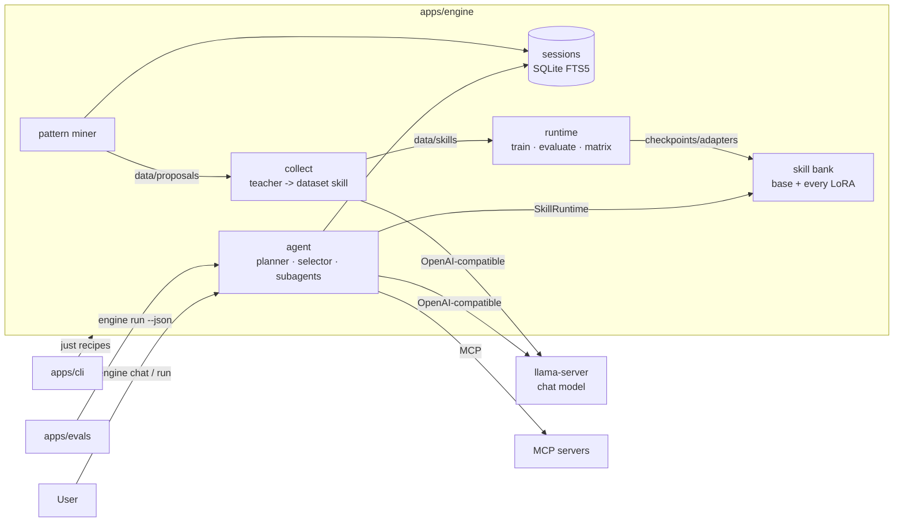
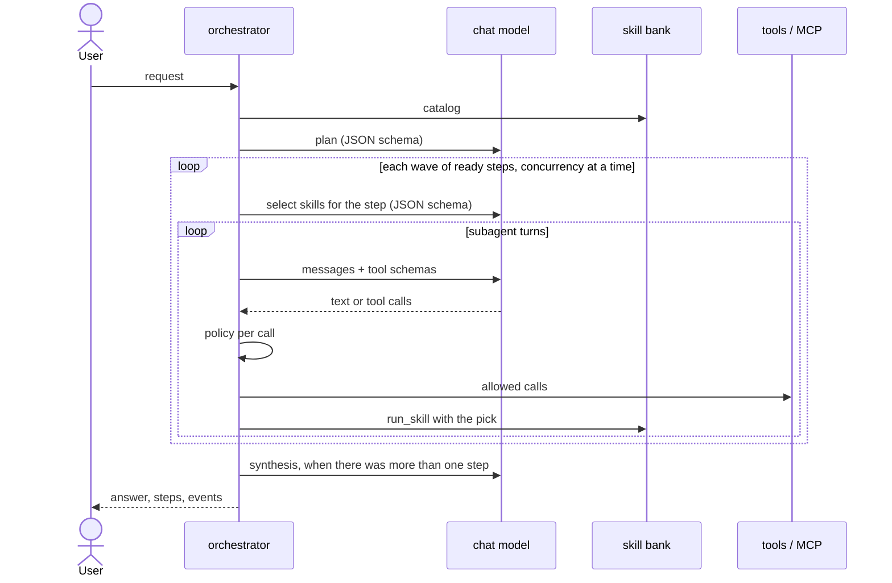
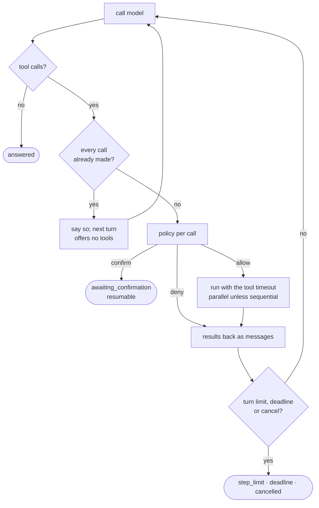

# Architecture

## What this is

A base masked diffusion LM stays frozen. Named low-rank deltas, skills, attach to it, are trained
one at a time on narrow auto-gradable tasks, and are activated in combinations and at chosen
points along the denoising trajectory.

The agent sits on top, in the same engine. An LLM plans a request into steps and picks which
skills each step equips; subagents act through tools and MCP servers, and use the
equipped skills through the diffusion model. Every run is a session, indexed, and recurring work
that no skill covers is proposed as a new skill, collected with a teacher model, and trained into
the bank.

`docs/decisions/0002-*` records why the agent is here and why the work is split between two models.

## Apps



| App | Reaches the others by |
|---|---|
| `apps/engine` | nothing; it is what the others reach |
| `apps/evals` | `engine run --json` per case; `apps/evals/core/types.py` holds the fields it reads |
| `apps/cli` | `just` recipes in subprocesses, and `engine chat --jsonl` for the chat pane |

Apps never import each other. `import-linter` enforces it in `just check`.

## Inside the engine

```
commands                             the engine command
wiring                               builds concrete implementations, opens MCP servers
agent | clients | tools | memory | collect
runtime                              train, evaluate, the composition matrix, the skill bank
telemetry                            Prometheus metrics and OpenTelemetry spans from trace events
{adapters, routing, skills} and backends
core                                 config, types, protocols, doubles, runs, determinism
```

A package imports one below it, never a sibling. Two contracts sharpen the rule: the agent side
(`agent`, `tools`, `memory`) never imports torch, `runtime`, `backends` or
`adapters`, so the loop is tested with no model stack; and only `clients`, `tools` and `collect`
open network connections.

`core` holds what everything builds on and nothing that does work. `core/types` splits into
`errors` (one `EngineError` base), `diffusion` (adapters, samples, scores, generation requests) and
`agent` (messages, tools, skills, plans, results, sessions, traces). `core/config` splits the same
way, into the model's tables and the `[agent.*]` tables, under one `Config`.

`adapters` owns the injection sites. `LoRALinear` wraps a frozen `nn.Linear` and holds a
name-keyed bank of deltas. Activation is read from an `AdapterState` held by reference, so
changing the live set is a dict assignment rather than a module walk, which is what makes
per-denoising-step routing affordable, and what lets one bank equip different skills per request.

`routing` owns schedules over the trajectory. It never imports `adapters`.

`skills` is the registry. A built-in skill is one module exposing `generate(n, seed, split)`,
`grade(sample, output)`, a `DESCRIPTION` the selector reads, and its prompt template. A dataset
skill is a directory under `data/skills/<name>` that collection wrote, with fixed train, dev and
eval files. Both satisfy `core.protocols.Skill`. `skills` imports no torch and no network client.

`backends` is the vendor layer, the only package that imports `third_party/nanoDiff`. A larger
diffusion LM (LLaDA, Dream) is a sibling module.

`runtime` trains one adapter, scores one condition, runs the tuned-prompt baseline, and holds the
skill bank: `SkillBank` builds the base once, loads every trained adapter, and equips per request
through a `PhaseRouter` over the shared `AdapterState`, under a lock. A request naming an
untrained skill, or a schedule boundary inside a sampler block, is refused with the reason.

`clients` is the two models as the agent sees them: `OpenAIChat` for the LLM, and the skill bank
as `LocalBank`, in the agent's own process, loaded on first use and run off the event loop.

`memory` is what the agent remembers: the session index and the pattern miner that reads it.

`collect` turns an approved skill spec into a dataset skill: the spec's own pairs, then examples
from a teacher LLM, deduplicated, shuffled by `collect.seed`, split once into files, recorded in a
`RunRecord`. A spec that is not approved is refused.

`commands` is the engine command: `chat` holds a warm agent and takes turns over stdin, in the
terminal or as JSON lines for the console; `run` does one request and exits. `runtime` also holds
the composition matrix, the research eval.

## The agent

| Protocol | Implementations | What it is |
|---|---|---|
| `ChatModel` | `clients.chat.OpenAIChat` | the LLM: plans, selects, drives each loop |
| `SkillRuntime` | `clients.local_bank.LocalBank` | the skill bank, in this process |
| `Tool` | `tools.builtin`, `tools.mcp.McpTool`, `agent.toolset.SkillTool` | a capability |
| `Policy` | `agent.policy.RiskPolicy` | allow, deny, or hold for the user |
| `TraceSink` | `agent.trace.JsonlTrace`, `Collector`, `Fanout`, `commands.chat.LineSink` | where events go |
| `SessionStore` | `memory.sessions.SqliteSessionStore` | the session index |

Every protocol has a double in `core/doubles.py`, which is how every agent test runs whole
requests with no model, network or disk.

### A request



1. **Catalog.** The bank's trained skills. A bank that cannot load or be reached means none; the
   run records a notice and carries on with tools only.
2. **Plan.** At most `planning.max_steps` steps, each depending only on earlier steps, so the plan
   is acyclic by construction. A plan the model cannot produce after one correction becomes one
   step holding the whole request, with `fallback` set and the reason recorded.
3. **Select.** Per step, the chat model reads the step and every trained skill's description and
   names at most `planning.max_skills`, or a phase schedule over them, or none. Names are checked
   against the catalog; one correction, then nothing is equipped and the reason is kept. With no
   trained skill there is no call.
4. **Act.** A subagent runs the step's tool loop. `run_skill` exists only when something is
   equipped and sends its input to the diffusion model with exactly that pick live.
5. **Answer.** One step's answer, or a synthesis of every step's result. A failed synthesis
   returns the step results as they are.

The session is saved after the plan and after every wave.

### The subagent loop



The loop owns every stopping condition. A tool's failure, timeout, bad arguments or unknown name
is a result the model reads, never a crash. Calling tools after they were withdrawn twice stalls
the step. Retryable model errors are retried with backoff inside the deadline.

### Risk and confirmation

| Class | Examples | Behaviour |
|---|---|---|
| `read_public` | `current_time`, `fetch_url`, `run_skill`, an MCP tool named like navigate or read | run |
| `read_authenticated` | a page in the user's own session | deny unless `policy.allow_authenticated_reads` |
| `prepare_write` | an MCP tool named like type or fill_form | run |
| `external_write` | an MCP tool named like click or submit, an unrecognised MCP tool | confirm immediately before |
| `destructive` | delete, cancel | confirm immediately before |
| `forbidden` | | deny, whatever the settings |

`policy.confirm_from` names the lowest class held for the user. A held call stops its step with
everything needed to resume it; `confirm` checks the token, expiry and payload hash, runs or
declines the call, and carries the step and the rest of the plan on.

MCP tools are named `server_tool`, classed by name unless the server's config sets a risk, and
treated as sequential. Each server is one `[[agent.mcp.servers]]` entry, over Streamable HTTP or
stdio.

### Sessions and patterns

Every run is a `SessionRecord` in SQLite, stored whole as JSON, with an FTS5 table over the
request, the answer and every step's goal. `engine run --resume <id>` gives the planner the
earlier request and answer; the `recall_sessions` tool lets a subagent search them.

The pattern miner reads the steps that ran with no skill equipped, clusters them by the keywords
of their goals, and proposes a skill for each cluster seen in `patterns.min_occurrences` distinct
sessions, with the steps' answers as worked pairs. It is rules, not a model call. Proposals are
written with `approved: false`, and collection refuses them until a person sets it:

```
engine skills propose --write  ->  data/proposals/name.json  ->  a person approves
  ->  engine skills collect  ->  data/skills/name  ->  engine skills train  ->  the bank equips it
```

### Tracing

One JSONL file per session under `.bijou/traces`, one line per event: run started, plan, skill
pick, every model call with tokens, duration, the prompt and the reply (up to
`agent.loop.record_content_chars`), every policy decision, every tool call and result, every
step's end, confirmations, notices. A run's events also come back in its result, which is what
evals read.

## Inference and observability

| What | Runs on | Started by |
|---|---|---|
| Chat model | llama-server, OpenAI-compatible, `--jinja --metrics` | the host, or `just up chat` |
| Diffusion model | the engine's own PyTorch sampler, in the agent's process | `just chat`, `just agent` |
| Traces | Phoenix, OTLP over HTTP | `just up phoenix` |
| Metrics | Prometheus, scraping `engine chat` (:9464), llama-server and the GPU exporter | `just up prometheus gpu-exporter` |
| Dashboards | Grafana: Bijou (agent, skill bank, llama-server, GPU) | `just up grafana` |
| Live counters | the console's metrics pane, from the agent itself | `just console` |

The diffusion model runs eager, one generation at a time under the bank's lock, with no prefix
K/V cache, so a phase schedule can switch skills mid-generation.

`engine.telemetry` reads the trace events the agent already emits; neither the loop nor any tool
knows it exists.

- `MetricsSink` counts events into Prometheus metrics in a registry the running agent owns,
  served at `telemetry.metrics_port` for as long as `engine chat` runs: runs, steps, model calls
  by purpose, tokens, tool calls and latency, policy decisions, skill picks. The skill bank
  records its own in the same registry: generations by skills and outcome, generation latency,
  lock wait, tokens, what it loaded. A one-shot `engine run` serves nothing, and is counted
  nowhere; its spans still reach Phoenix.
- `OtelSink` builds OpenInference spans from the same events and exports them over OTLP when
  `BIJOU_TELEMETRY__OTLP_ENDPOINT` is set: `agent.run` (CHAIN, with `session.id`), a `step` per
  plan step (AGENT, with its skills), an `llm` span per model call (with the prompt, the reply
  and tokens) and a `tool` span per tool call. A run waiting on a confirmation ends its span;
  `confirm` opens `agent.confirm` in the same session.

`deploy/compose.yml` holds the services in profiles; nothing starts without one.
`deploy/inference/README.md` covers the chat model and VRAM on a 6 GB GPU.

## Evals

`apps/evals` runs golden cases, `apps/evals/cases/*.jsonl`, each through `engine run --json`, and
scores each on the suites it names: status, plan, skills, tools, answer, latency. A suite with nothing to
check for a case does not count it. `evals baseline` promotes a report's pass counts to
`apps/evals/baseline.json`; `evals compare` fails when a suite drops below it.

The composition matrix in the engine is the research eval. Agent evals say nothing about adapters.

## Console

`apps/cli` lists every `just` recipe, runs each in its own process group, streams its output, and
shows GPUs, the checkpoint, trained artifacts, which compose services are up, and the last run. It
starts `engine chat --jsonl` with the console and talks to it over stdin: the conversation on the
right, every trace event in the log pane beside it, and a metrics pane that asks the agent for its
Prometheus registry every `console.metrics_interval_secs`, so the counters Grafana charts are
readable without leaving the terminal, beside the GPU and the box. A service row starts and stops
one compose service and follows its logs; `nvtop` and `htop` are handed the whole terminal while
the console is suspended, and everything else keeps streaming. It links nothing in the repo and
reads only its own keys from `bijou.toml`.

## Tech stack

| Layer | Tool | Where |
|---|---|---|
| Language | Python 3.12 | `.python-version`, `apps/*/pyproject.toml` |
| Workspace | uv workspace, one committed `uv.lock` | `pyproject.toml` `[tool.uv.workspace]` |
| Base model | nanoDiff 150M SFT checkpoint, vendored as a submodule | `third_party/nanoDiff`, `[backend]` |
| Model stack | PyTorch (CUDA or CPU build), tiktoken, NumPy | engine `train`, `cuda`, `cpu` extras |
| Chat model | any OpenAI-compatible server; llama-server with Qwen3 by default | `[agent.llm]`, `[collect]` |
| HTTP | httpx to call out; prometheus-client serves `/metrics` | `engine/clients`, `engine/telemetry` |
| MCP | the official `mcp` SDK `Client` | `engine/tools/mcp.py` |
| Sessions | SQLite with FTS5 | `engine/memory/sessions.py` |
| Chat inference | llama.cpp `llama-server` (CUDA image in compose) | `deploy/compose.yml` profile `model` |
| Traces | OpenTelemetry SDK, OTLP over HTTP, Phoenix | `engine/telemetry/otel.py`, profile `observe` |
| Metrics | prometheus-client, Prometheus, Grafana, nvidia GPU exporter | `engine/telemetry/metrics.py`, `deploy/monitoring` |
| Services | Docker Compose with profiles | `deploy/compose.yml`, `just up` / `just down` |
| Config | pydantic, pydantic-settings over one `bijou.toml` | `engine/core/config`, each app's `core/config.py` |
| Commands | Typer, Rich | `engine`, `evals` |
| Console | Textual | `apps/cli` |
| Tasks | just | `justfile` |
| Lint and format | ruff | `[tool.ruff]` in `pyproject.toml` |
| Types | mypy `--strict` | `[tool.mypy]` |
| Layering | import-linter, between apps and inside the engine | `[tool.importlinter]`, `scripts/check-deps.sh` |
| Tests | pytest, pytest-asyncio | `apps/*/tests` |
| Checkpoints | Hugging Face Hub via `hf download` | `scripts/checkpoints.sh` |
| CI/CD | GitHub Actions; the engine image pushed to GHCR | `.github/workflows/`, `deploy/Dockerfile` |
| Security | pip-audit on the locked deps, gitleaks | `.github/workflows/security.yml` |

## Invariants

Adapter targets are named by module suffix and configured. `lm_head` is rejected at config load
because `tie_embeddings` ties it to `tok_emb`, so adapting the head would adapt the embedding
table.

A newly attached adapter is inert: `B` is zero-initialised, so activating an untrained adapter
cannot perturb the frozen base. `tests/model/test_adapters.py` asserts bit-identical logits.

The denoising loop lives in `backends`, reimplemented rather than reused, because upstream
`generate` takes no per-step hook and the `ActivationPolicy` seam needs one. It must match
upstream token for token when no adapter is active.

Generation runs with no prefix K/V cache. `PhaseSchedule.validate_against_blocks` rejects a phase
boundary inside a sampler block, in the matrix and in the bank alike.

A dataset skill's splits are separate files fixed at collection, so no seed moves an example
across them.

Every train, evaluate and collect run writes an immutable `RunRecord`. Writing over one is refused.

A skill spec is approved by a person, never by code. The miner writes `approved: false`.

Every write-class tool call goes through `Policy`. Nothing that posts, submits, clicks or deletes
runs without a confirmation bound to its exact payload.

Agent answers are model output. They are never written back as skill data except through a
reviewed proposal.

## What is not here

A trained skill router. The selector is a prompted classifier over skill descriptions; a learned
router waits until there are sessions to learn from.

Adapter paging and multi-GPU serving. The bank holds every adapter on one base.

Authenticated sessions. `read_authenticated` is denied by default, and nothing stores a
credential.
